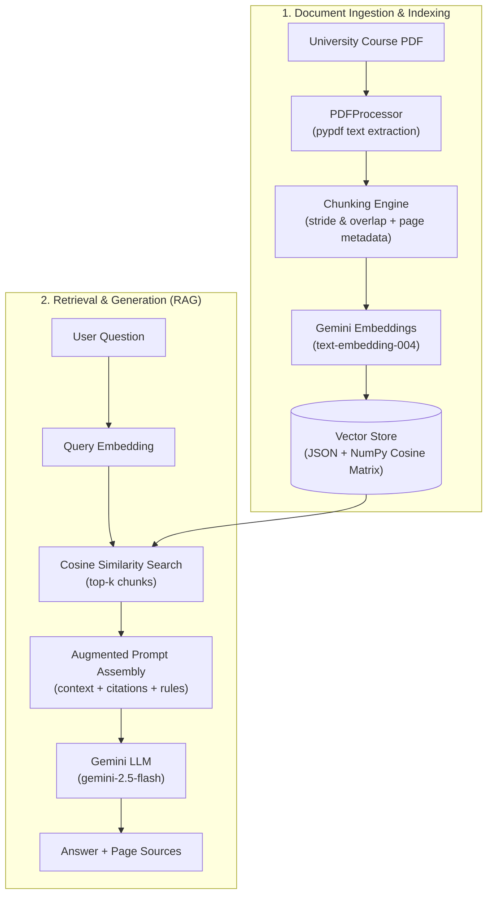

# 🎓 University Course Document RAG System

A complete **Retrieval-Augmented Generation (RAG)** application built with **FastAPI** and **Google Gemini** that allows users to upload university course PDFs and ask detailed, grounded questions about them.

---

## 📌 Project Overview & Task Alignment

> **Instructor Task:**  
> *"Upload a PDF (for example, a university course document), and ask questions about it. The system uses RAG to retrieve relevant information from the PDF and an LLM to generate the answer."*

This repository satisfies all requirements:
1. **Document Ingestion & Parsing:** Extracts clean text page by page from uploaded PDFs using `pypdf`.
2. **Document Chunking:** Implements sliding window semantic chunking with overlap to preserve context across boundaries and tags each chunk with its exact document and page number.
3. **Vector Store & Embeddings:** Generates vector embeddings using Google's `text-embedding-004` (or `gemini-embedding-001`) and computes cosine similarity ranking with `numpy`.
4. **Context Retrieval & Augmented Prompting:** Retrieves top-$k$ relevant chunks, injects them into an academic assistant prompt, and directs the LLM to ground its response strictly in the provided excerpts.
5. **Generation & Citation:** Generates answers via `gemini-2.5-flash` with citations referencing specific document pages.
6. **FastAPI REST API:** Complete interactive API documentation available at `/docs` (Swagger UI).

---

## 🏛️ System Architecture



---

## 📁 Project Structure

```
RAG_Task/
├── app/
│   ├── __init__.py
│   ├── config.py              # Environment variables & configuration
│   ├── pdf_processor.py       # PDF extraction & sliding-window chunking
│   ├── vector_store.py        # Vector embedding & cosine similarity retrieval
│   ├── rag_service.py         # RAG pipeline orchestration & prompt assembly
│   └── main.py                # FastAPI routes (/upload, /query, /documents)
├── data/
│   ├── uploads/               # Saved PDF documents
│   └── vector_store.json      # Persisted vector database
├── CS402_Artificial_Intelligence_Syllabus.pdf  # Ready-to-use sample syllabus
├── generate_sample_pdf.py     # Script to generate sample university PDFs
├── requirements.txt           # Project dependencies
├── .env.example               # Example configuration file
├── .env                       # Active environment configuration
└── README.md                  # Project documentation
```

---

## 🚀 Quickstart Guide

### 1. Prerequisites
- Python 3.10+ installed
- A Google Gemini API Key (Get a free key from [Google AI Studio](https://aistudio.google.com/))

### 2. Configure Your API Key
Open the `.env` file in the root folder and add your key:
```env
GEMINI_API_KEY=AIzaSy...your_actual_gemini_api_key
GEMINI_MODEL=gemini-2.5-flash
EMBEDDING_MODEL=text-embedding-004
```

### 3. Run the FastAPI Server
Start the Uvicorn development server:
```bash
uvicorn app.main:app --reload
```
The server will start at:
* **API Root:** `http://127.0.0.1:8000/`
* **Interactive Swagger UI:** `http://127.0.0.1:8000/docs`

---

## 🧪 Testing via Swagger UI (`/docs`)

### Step 1: Upload a Course PDF
1. Go to `http://127.0.0.1:8000/docs` in your browser.
2. Click **`POST /upload`** $\rightarrow$ **Try it out**.
3. Choose the sample PDF provided in this folder:  
   `CS402_Artificial_Intelligence_Syllabus.pdf` (or any university document).
4. Click **Execute**.  
   *The server extracts the text, segments it into chunks with page numbers, computes embeddings, and indexes them.*

### Step 2: Ask Questions (`POST /query`)
1. Click **`POST /query`** $\rightarrow$ **Try it out**.
2. Enter your question in the request body:
   ```json
   {
     "question": "What is the late submission policy and are there slip days?"
   }
   ```
3. Click **Execute**.  
   *You will receive the grounded answer along with exact source snippets, page numbers, and similarity scores.*

---

## 🎯 Sample Questions to Test with `CS402_Artificial_Intelligence_Syllabus.pdf`

| Question | What It Tests |
|---|---|
| *"Who is the course instructor and when are her office hours?"* | Exact entity retrieval from Page 1 |
| *"What is the grading breakdown and how much is the capstone project worth?"* | Structured table extraction & numerical reasoning |
| *"What are the consequences of submitting an assignment 2 days late?"* | Policy interpretation and condition matching |
| *"What topics are covered in Weeks 5-6?"* | Multi-page schedule retrieval from Page 2 |
| *"Does this course cover quantum computing?"* | Hallucination test (LLM should correctly state the document does not contain this) |

---

## 💡 Key RAG Concepts for Your Instructor / Viva

1. **Why RAG instead of feeding the whole PDF to the LLM?**
   - Cost and latency: Searching only relevant chunks requires fewer input tokens.
   - Reduced distraction/hallucination: Focusing the prompt on the top-$k$ relevant passages yields higher precision.
   - Scalability: A vector store can index hundreds of course documents, textbooks, and past papers.

2. **Chunking Strategy & Overlap:**
   - We use a window size of 500 characters with an overlap of 100 characters.
   - Overlap ensures that sentences or facts split across chunk boundaries aren't severed, preserving semantic continuity.

3. **Cosine Similarity Search:**
   $$\text{similarity}(\mathbf{u}, \mathbf{v}) = \frac{\mathbf{u} \cdot \mathbf{v}}{\|\mathbf{u}\| \|\mathbf{v}\|}$$
   - Compares the directional angle between the query vector and document chunk vectors in high-dimensional space.
